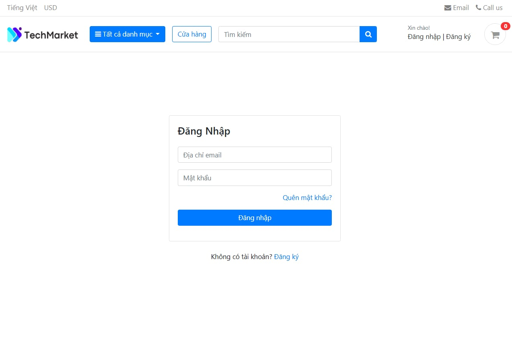
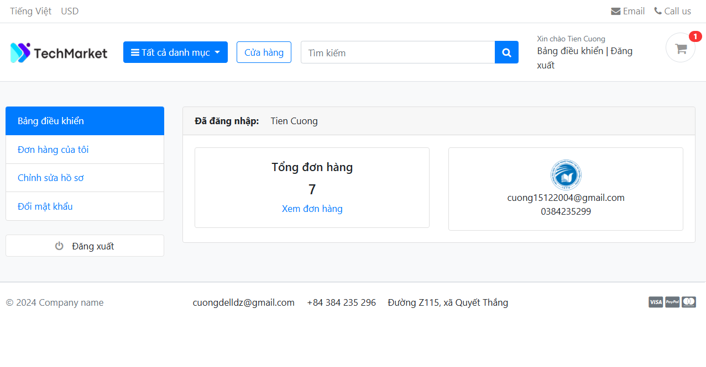
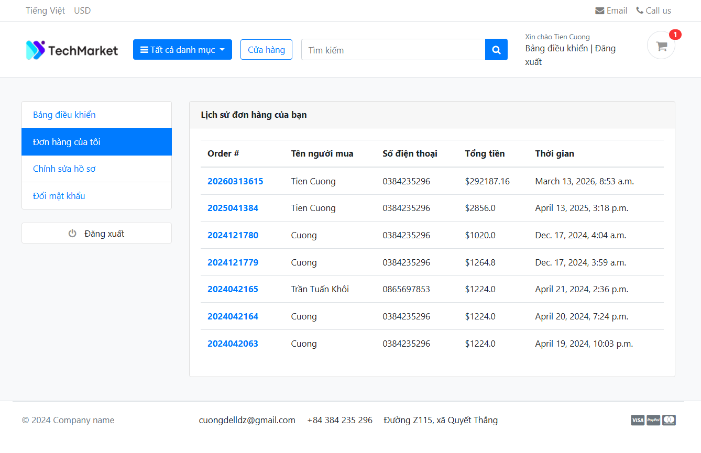
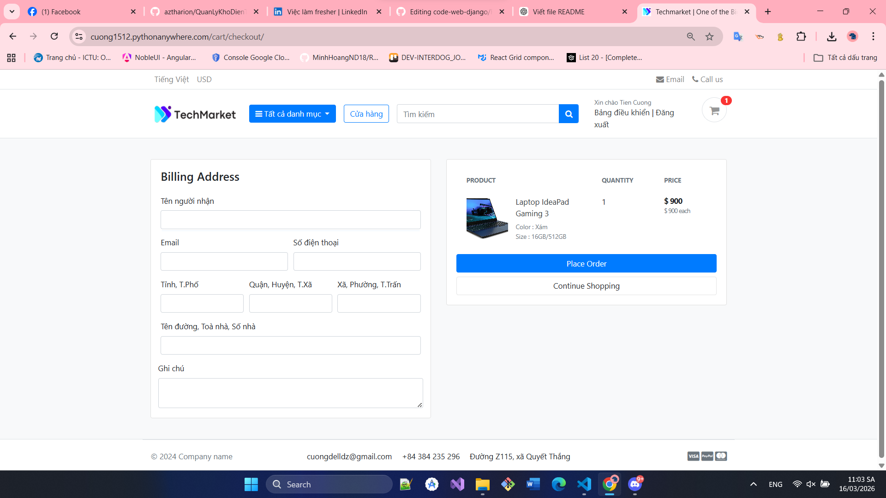
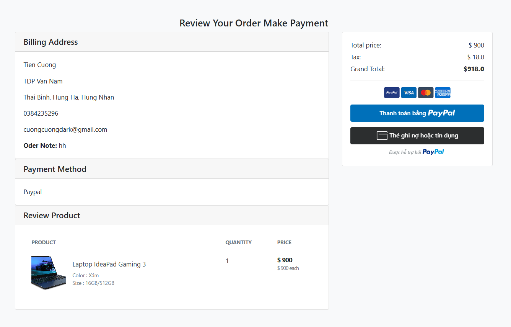
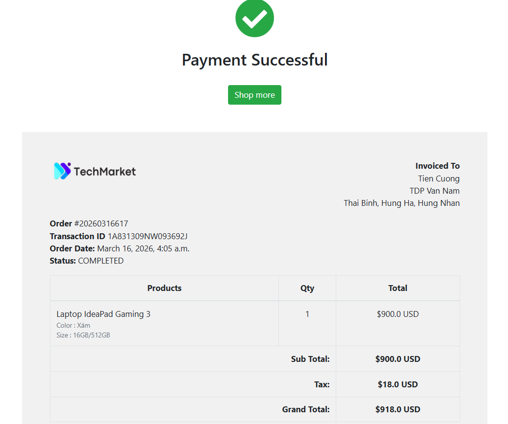
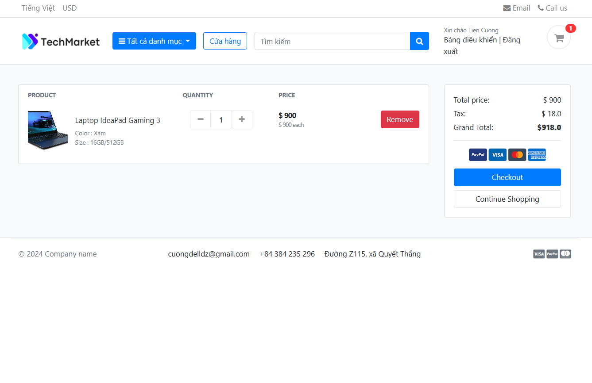
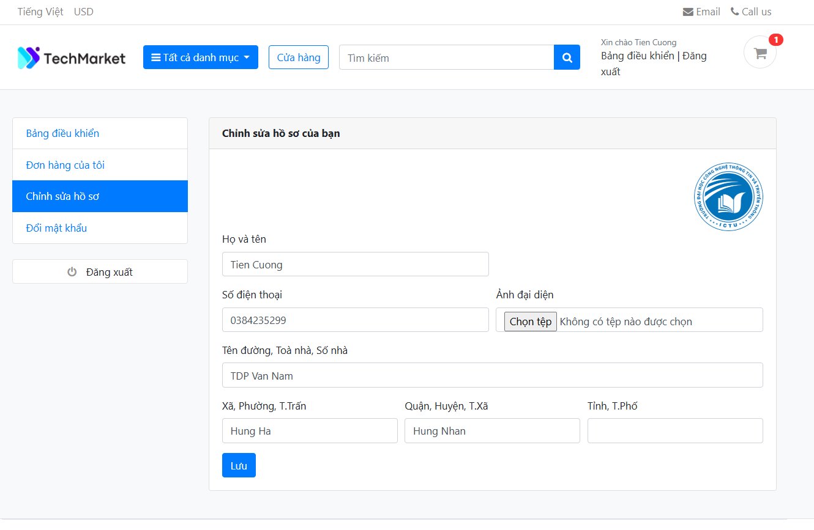

# Do an mon Phan tich thiet ke he thong thong tin

De tai: Xay dung website thuong mai dien tu (Django) voi cac chuc nang gio hang, dat hang, thanh toan va quan tri.

## Getting Started

1. Tai source code ve may:

```bash
git clone <repo-url>
cd code_web
```

2. Tao moi truong ao va cai thu vien:

```bash
python -m venv .venv
.venv\Scripts\activate
pip install -r requirements.txt
```

3. Chay migrate va khoi dong server:

```bash
python manage.py migrate
python manage.py runserver
```

4. Truy cap:

- Trang chu: http://127.0.0.1:8000/
- Trang quan tri: http://127.0.0.1:8000/admin/

### Tai khoan demo

- Demo: https://cuong1512.pythonanywhere.com/
- User dang nhap:
	- Email: cuong15122004@gmail.com
	- Mat khau: Cuong0dz

### Tai khoan Admin

- Admin: https://cuong1512.pythonanywhere.com/admin/login/?next=/admin/
- Email: developer.cuong@gmail.com
- Mat khau: Cuong1512@

### Tai khoan Paypal Sandbox

- Email: cuong.sandboc@gmail.com
- Mat khau: Cuong0dz

## Giao dien

### Dang nhap



### Trang chu


### Dashboard



### Don hang



### Quy trinh thanh toan



### Payment



### Thanh toan thanh cong



### Ro hang



### Chinh sua ho so



## Cong nghe su dung

- Python
- Django
- SQLite
- HTML/CSS/JavaScript
- Bootstrap
- PayPal Sandbox

